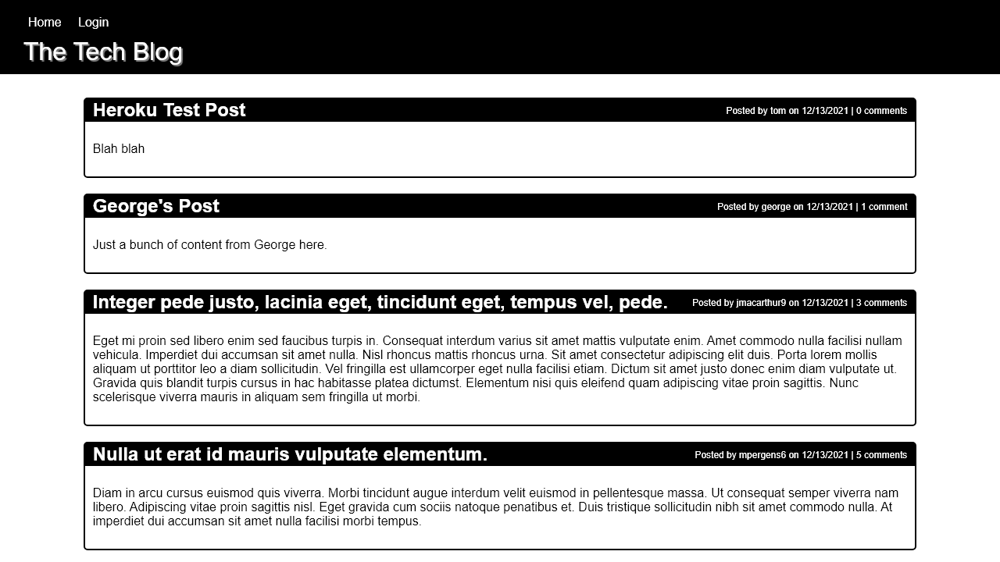

# CMS MVC Challenge

Develop and deploy a cms using MVC method and deploy to heroku

## Table of Contents
1. [Installation](#installation)
1. [Usage](#usage)
   1. [Screenshots](#screenshots)
1. [License](#license)
1. [Contributing](#contributing)
1. [Tests](#tests)
1. [Questions](#questions)

## Installation
npm i

## Usage
Clone the repository. Use included schema to initialize your DB and then run npm run seed to put data into the DB. Then npm start to run the server
### Screenshots
[Live Deployed Link](https://coding-bootcamp-techblog.herokuapp.com/)
### Mobile

### Browser

  

## License
[MIT License](https://mit-license.org/)
  

## Contributing
n/a

## Tests
n/a

## Questions
[Find me on Github](https://github.com/tbellenger)

Or you can contact me at tbellenger@gmail.com if you have any questions

